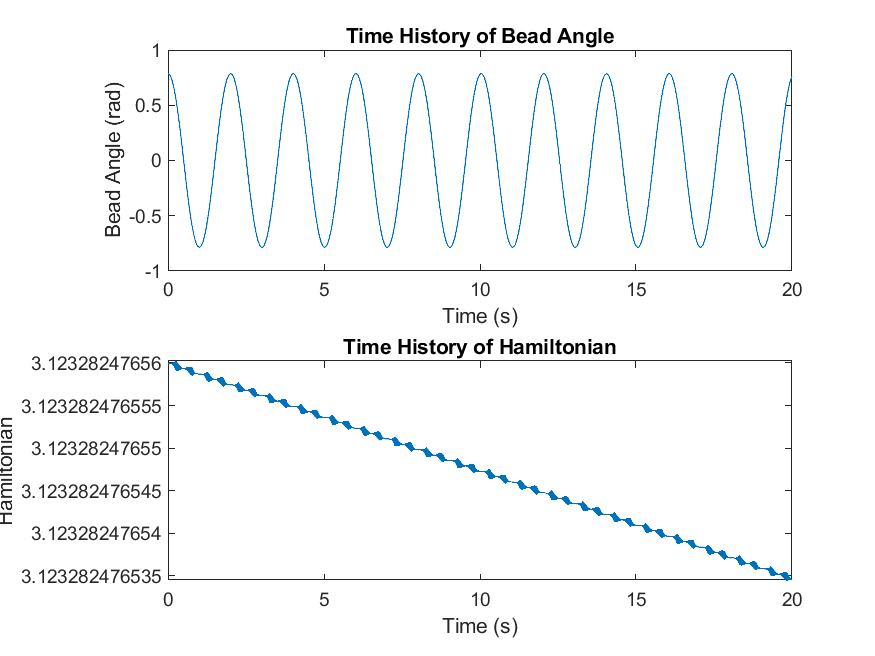

# :radio_button: Bead on Hoop Simulation

This repository contains a MATLAB script `bead_on_hoop_simulation.m` that simulates the dynamics of a bead constrained to move on a rotating hoop, subject to gravity. The script defines the system parameters, solves the bead-on-hoop dynamics, and plots the results for the angle of the bead and the Hamiltonian over time.

### Main Functions

The script consists of the following main functions:

- `init_params`: Initializes the system parameters.
- `solve_dynamics`: Solves the bead-on-hoop dynamics using the ode45 solver.
- `bead_on_hoop_dynamics`: Calculates the bead-on-hoop dynamics based on the system parameters.
- `plot_and_save_results`: Plots and saves the simulation results.

### Usage

To use the script, simply call the function `bead_on_hoop_dynamics()` in MATLAB. The script will run the simulation, plot the results, and save a figure with the simulation results as a PNG file named `bead_on_hoop_simulation_results.png`.

```matlab
bead_on_hoop_simulation()
```



### Dependencies

The script requires MATLAB and the ODE45 solver, which is included in the core MATLAB package.

### Author

**Alexander Little**

- 🏫 Toronto Metropolitan University
- 📧 corbyn.little@torontomu.ca
- 💼 [LinkedIn](https://www.linkedin.com/in/aclittle/)
- 📚 [GitHub](https://github.com/space-ranger-99)

*Version 1.0*
